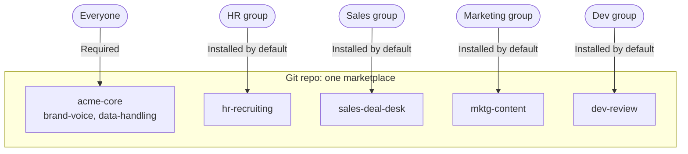

# acme-plugins

A demo company plugin marketplace: one core plugin plus department plugins, versioned in Git, usable in Claude and Microsoft 365 Copilot.

"Acme" is a fictional company. This repo is public and holds no company data. A real deployment uses a private repo.

## Install

Claude Code:

```
/plugin marketplace add JosephSearle/personal-claude-plugins
/plugin install acme-core@acme-plugins
/plugin install hr-recruiting@acme-plugins
```

Claude Enterprise (production): Organization settings > Plugins & skills > Add > Sync from GitHub. The repo must be private or internal. Public repos are rejected.

Microsoft 365 Copilot: build the packages, then upload each zip in the Microsoft 365 admin center under Manage apps > Upload custom app. See [Microsoft 365 Copilot](#microsoft-365-copilot).

## Usage

Install `acme-core` plus the plugin for your department. Then ask in plain language. Skills load when the request matches their description.

| Say | Skill | Plugin |
| --- | --- | --- |
| "Draft a job advert for a data analyst" | `job-advert` | `hr-recruiting` |
| "Build an interview scorecard for this role" | `interview-scorecard` | `hr-recruiting` |
| "Summarise this deal for my manager" | `deal-summary` | `sales-deal-desk` |
| "Draft a proposal from these notes" | `proposal-draft` | `sales-deal-desk` |
| "Write a content brief on remote onboarding" | `content-brief` | `mktg-content` |
| "Outline a launch campaign" | `campaign-plan` | `mktg-content` |
| "Review this pull request" | `pr-review` | `dev-review` |
| "Write the PR description" | `pr-description` | `dev-review` |
| "Make this email sound like us" | `brand-voice` | `acme-core` |
| "Redact this document" | `data-handling` | `acme-core` |

## Structure



- **Core** holds what every department needs. It is required for all staff.
- **Department plugins** hold one team's workflows. Each is owned by that team's champion.
- Plugins do not import each other. All installed skills load into one session. Department skills name core skills in their instructions ("Apply the `brand-voice` skill"), and core is always present.
- Put shared rules in core. Put workflow knowledge in the department plugin.
- Keep each plugin to 3-10 skills. Copilot allows 20 per package.

```
.claude-plugin/marketplace.json     catalogue
plugins/<name>/
  .claude-plugin/plugin.json        name, version, description
  skills/<skill>/SKILL.md           the skills
scripts/validate.py                 repo checks
scripts/build-m365.sh               Copilot packages
.github/CODEOWNERS                  who approves what
.github/workflows/validate.yml      CI
```

## Skills only

This release has skills only: no commands, sub-agents, hooks or connectors.

- Copilot does not load commands, sub-agents or hooks. Anything essential lives in skills so both products behave the same.
- Connectors come later, after talking to each department about the systems they use.
- No personal data in any skill. The `data-handling` skill enforces placeholders, and CI scans for emails, keys and national insurance numbers.

## Governance

Every change goes through a pull request.

1. CODEOWNERS requires the department champion and the AI department to approve.
2. CI runs `scripts/validate.py --base <target branch>`. It checks:
   - marketplace and plugin manifests, kebab-case names, semver
   - each skill's name matches its folder and has a description of 1-1024 characters
   - skill count against the Copilot limit
   - no top-level `bin/`
   - every plugin has a CODEOWNERS entry
   - no secrets or personal data
   - the plugin version is bumped when its files change
3. A pilot group tests the change before wider rollout.

Run the checks locally:

```
pip install pyyaml
python scripts/validate.py
claude plugin validate .
```

## Versioning

- Semantic versioning, set in `plugin.json` only. Never in `marketplace.json`.
- Bump on every change to a plugin. Claude Code updates only when the version changes.
- MAJOR: skill renamed or removed. MINOR: skill added. PATCH: wording fix.
- Record each release in [CHANGELOG.md](CHANGELOG.md), newest first.
- Claude organisation sync reads the default branch only. A tag alone releases nothing. Merge the pull request to release.
- For a beta channel, sync a second marketplace from a `beta` branch to a pilot group.
- Never rename a plugin. The name is the install identifier.

## Microsoft 365 Copilot

Skills use the open Agent Skills format, so the same files work in Copilot Cowork. Copilot needs a zip per plugin.

```
npm install -g @microsoft/m365agentstoolkit-cli
PRIVACY_URL=https://example.com/privacy \
TERMS_URL=https://example.com/terms \
WEBSITE_URL=https://example.com \
  scripts/build-m365.sh
```

Output: `build/m365/<plugin>.zip`. The script imports each plugin with `atk`, sets manifest schema v1.28 and the display name, validates, and packages.

Verified: all five plugins build and pass `atk validate`.
Not verified: upload and deployment in a Microsoft 365 tenant.

Notes:
- Core and department plugins are separate packages. Deploy core to everyone and each department package to its group.
- An admin sets which users or groups see each package.
- Users need a Microsoft 365 Copilot licence.
- Copilot does not load `commands/`, `agents/` or `hooks/`.

## Limits

- CODEOWNERS teams are placeholders. Replace `@acme/...` with real teams.
- No plugin declares a dependency on core. Core is made present by group access (Required). Claude Code plugin dependencies could express this. Not used in this demo.
- Group access in Claude requires an Enterprise plan.
