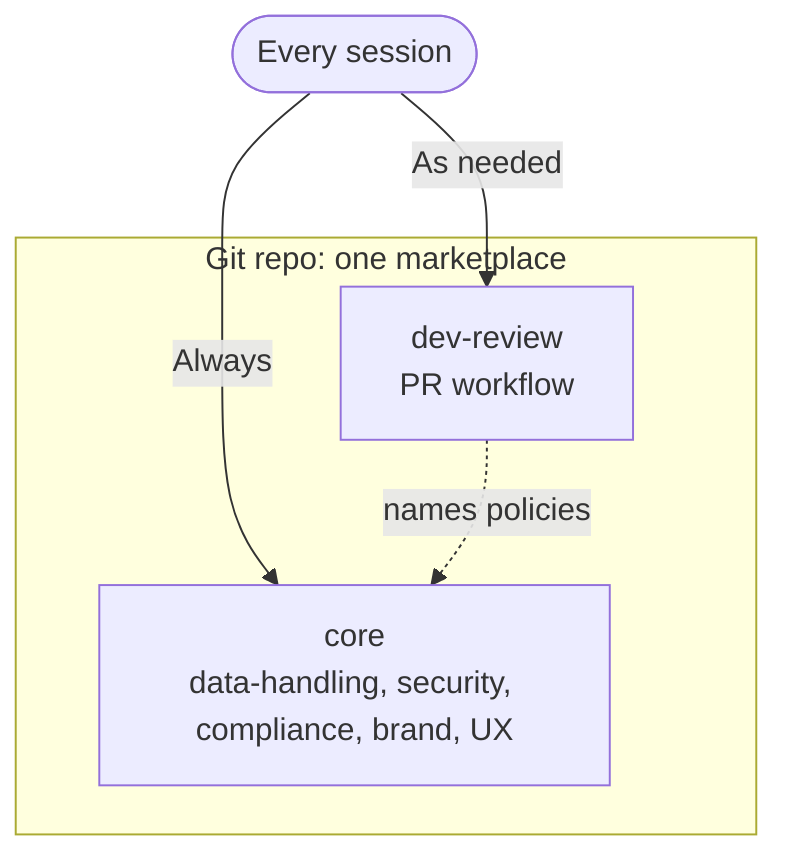

# personal-plugins

[](https://github.com/JosephSearle/personal-claude-plugins/actions/workflows/validate.yml)
[](LICENSE)

> A personal Claude Code plugin marketplace: a core plugin of shared policies plus a dev-review example, versioned in Git and usable in Claude and Microsoft 365 Copilot.

My own skills for day-to-day AI engineering and SDLC work, kept in one marketplace so I can install the same set wherever I use Claude Code. Skills are authored in the plugins here; each plugin is one on/off switch for a kind of work.

<details>
<summary>Table of Contents</summary>

- [Install](#install)
- [Usage](#usage)
- [Structure](#structure)
- [Skills only](#skills-only)
- [Governance](#governance)
- [Versioning](#versioning)
- [Microsoft 365 Copilot](#microsoft-365-copilot)
- [Limits](#limits)
- [Maintainers](#maintainers)
- [Contributing](#contributing)
- [License](#license)

</details>

## Install

```
/plugin marketplace add JosephSearle/personal-claude-plugins
/plugin install core@personal-plugins
/plugin install dev-review@personal-plugins
```

Install `core` everywhere, then add `dev-review` when working on branches and pull requests.

Also usable in Microsoft 365 Copilot — see [Microsoft 365 Copilot](#microsoft-365-copilot) — and can be synced org-wide via Claude Enterprise (Organization settings > Plugins & skills > Add > Sync from GitHub; the repo must be private or internal, public repos are rejected).

## Usage

Ask in plain language. Skills load when the request matches their description.

| Plugin | Skills | Install when |
| --- | --- | --- |
| `core` | `data-handling`, `security-baseline`, `security-api`, `security-llm`, `security-mcp`, `security-agent`, `compliance-gdpr`, `compliance-eu-ai-act`, `brand-personal`, `ux-personal` | Always. Holds the policies every other plugin builds on. |
| `dev-review` | `pr-review`, `pr-description`, `pr-template`, `conventional-commits` | Working through branches, commits and pull requests. |

`brand-personal`, `ux-personal` and the security and compliance skills state they apply to my own projects, not an employer's. Disable `core` in a work context that has its own policies.

Example requests:

| Say | Skill |
| --- | --- |
| "Write the PR description for this branch" | `pr-description` |
| "Review this pull request" | `pr-review` |
| "Review the security of this MCP server design" | `security-mcp` |
| "Does this feature need a GDPR review?" | `compliance-gdpr` |
| "Redact this log" | `data-handling` |

## Structure



- **Skills live inside the plugin that owns them.** A plugin installs as a cached copy of its own folder, so a skill outside it would not ship.
- **Core holds the policies.** Any plugin can name a core skill in its instructions (for example "apply `security-baseline`"). Policies are written once and apply everywhere.
- Plugins do not import each other. All installed skills load into one session, so core is present by convention (install it first).
- Keep each plugin to 10 skills or fewer. Copilot allows 20 per package.

```
.claude-plugin/marketplace.json     catalogue
plugins/<name>/
  .claude-plugin/plugin.json        name, version, description
  skills/<skill>/SKILL.md           the skills (plus references/, assets/, scripts/)
scripts/validate.py                 repo checks
scripts/build-m365.sh               Copilot packages
.github/CODEOWNERS                  who approves what
.github/workflows/validate.yml      CI
```

Skills were imported from [JosephSearle/skills](https://github.com/JosephSearle/skills) `catalog/`. Their `evals/` folders stay in that repo, so test fixtures are not shipped to installs. Other catalogue skills (SDLC, repository docs, prompts, incidents) are not imported yet; they can become further plugins when needed.

## Skills only

This release has skills only: no commands, sub-agents, hooks or connectors.

- Copilot does not load commands, sub-agents or hooks. Anything essential lives in skills so both products behave the same.
- Connectors come later, once a specific tool needs one.
- No secrets or personal data in any skill. The `data-handling` skill enforces placeholders, and CI scans for emails, API keys, tokens and National Insurance numbers.

## Governance

Every change goes through a pull request and must pass CI before merging.

1. CI runs `scripts/validate.py --base <target branch>`. It checks:
   - marketplace and plugin manifests, kebab-case names, semver
   - each skill's name matches its folder and has a description of 1-1024 characters
   - skill count against the Copilot limit
   - no top-level `bin/`
   - every plugin has a CODEOWNERS entry
   - no secrets or personal data
   - the plugin version is bumped when its files change
2. Try the change in a live Claude Code session before merging.

See [Contributing](#contributing) for how to run these checks locally before opening a pull request.

## Versioning

- Semantic versioning, set in `plugin.json` only. Never in `marketplace.json`.
- Bump on every change to a plugin. Claude Code updates only when the version changes.
- MAJOR: skill renamed or removed. MINOR: skill added. PATCH: wording fix.
- Record each release in [CHANGELOG.md](CHANGELOG.md), newest first.
- Claude organisation sync reads the default branch only. A tag alone releases nothing. Merge the pull request to release.
- For a beta channel, sync a second marketplace from a `beta` branch to a pilot group.
- Never rename a plugin. The name is the install identifier.

## Microsoft 365 Copilot

Skills use the open Agent Skills format, so the same files work in Copilot Cowork. Copilot needs a zip per plugin.

```
npm install -g @microsoft/m365agentstoolkit-cli
PRIVACY_URL=https://example.com/privacy \
TERMS_URL=https://example.com/terms \
WEBSITE_URL=https://example.com \
  scripts/build-m365.sh
```

Output: `build/m365/<plugin>.zip`. The script imports each plugin with `atk`, sets manifest schema v1.28 and the display name, validates, and packages.

Verified: both plugins build and pass `atk validate`.
Not verified: upload and deployment in a Microsoft 365 tenant.

Notes:
- Each plugin is a separate package. Deploy `core` to every tenant user and the others to whoever needs them.
- An admin sets which users or groups see each package.
- Users need a Microsoft 365 Copilot licence.
- Copilot does not load `commands/`, `agents/` or `hooks/`.

## Limits

- No plugin declares a dependency on core. Core is made present by convention (install it first). Claude Code plugin dependencies could express this; not used here.
- Org-wide Enterprise sync and Microsoft 365 group assignment both need the respective admin plans. Not needed for personal, single-user use.

## Maintainers

Maintained by [Joseph Searle](https://github.com/JosephSearle). See [CODEOWNERS](.github/CODEOWNERS).

## Contributing

Open a pull request against `main`. See [Governance](#governance) for the review and rollout process. Before submitting, run the same checks CI runs:

```bash
pip install pyyaml
python scripts/validate.py
claude plugin validate .
```

## License

MIT © 2026 Joseph Searle. See [LICENSE](LICENSE).
