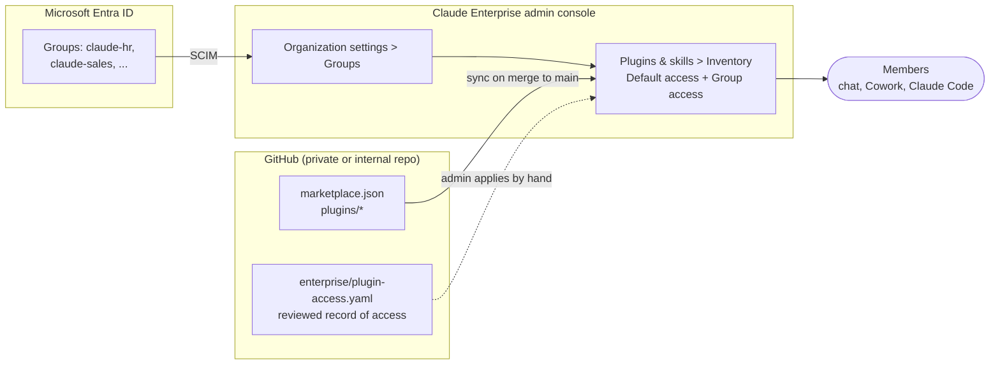

# Claude Enterprise: department-scoped plugins

Spike: how this marketplace runs on Claude Enterprise so each department sees only its own plugins.

**Question.** Can one Git-synced marketplace serve every department, with each department's plugins visible and usable only to that department?

**Answer.** Yes. Enterprise sets access per plugin per group. Set each department plugin to **Not available** for the whole organisation, then grant it to that department's group. Access lives in the admin console, not in Git. This repo records the intended settings in [`enterprise/plugin-access.yaml`](../../enterprise/plugin-access.yaml) and CI checks them.

Current matrix: [access-matrix.md](access-matrix.md).

## How it fits together



- **Content** comes from Git. A merged pull request with a version bump syncs the plugins.
- **Membership** comes from Entra ID through SCIM. Nobody maintains groups in Claude.
- **Access** is set in the console. The YAML file is what the console should say.

## Access rules

| Level | Members see |
| --- | --- |
| Required | Pre-installed. Cannot turn it off. Also forced on in Claude Code. |
| Installed by default | Pre-installed. Can turn it off. |
| Available to install | Listed on Discover. Add it themselves. |
| Not available | Nothing. Cannot see or add it. |

Resolution:

1. Each group uses its override for the plugin, or the org default if it has none.
2. A member in several groups gets the **most permissive** value.
3. A member in no group gets the org default.

Consequence: an override can only widen access safely. Setting `claude-sales: not-available` on a plugin whose default is `installed-by-default` does not keep it from a salesperson who is also in any other group. `scripts/access.py check` rejects that pattern.

Anthropic describes group access as a way to give teams the tools they need, not as a security boundary. Treat **Not available** as controlling what members see. Keep secrets and personal data out of every plugin regardless.

## Set up

Prerequisites: Enterprise plan; Cowork and Skills enabled for the organisation; an Owner, or a custom role with **Libraries: Can manage** and **Identity & Access: Can view**.

1. **Create groups in Entra ID.** One per department, named as in the policy file (`claude-hr`, `claude-sales`, ...).
2. **Provision them to Claude by SCIM.** They then appear in Organization settings > Groups.
3. **Move the repo to GitHub Enterprise.** It must be private or internal. Install the Claude GitHub App on it.
4. **Add the marketplace.** Organization settings > Plugins & skills > Marketplaces > Add > Sync from GitHub. Enter `owner/repo`. Keep "Sync automatically" on.
5. **Apply the policy.** For each plugin in [access-matrix.md](access-matrix.md) under "Console settings": Inventory > plugin menu > **Default access**, then **Group access... > Add groups**.
6. **Lock down side doors.** In the **Policy** tab, restrict who members can share their own plugins with, and require review for plugins submitted to the organisation library. Otherwise a member can pass a copy of a department plugin around the catalogue.
7. **Verify.** Sign in as a test member of one group. Confirm Customize > Plugins shows exactly what `python scripts/access.py resolve <group>` prints.

## Change process

| Change | Where | Who approves |
| --- | --- | --- |
| Edit a department plugin | Pull request to `plugins/<name>/`, version bumped | That department's champions (CODEOWNERS) |
| Add a plugin | Pull request adding the plugin **and** its rule in `plugin-access.yaml` | AI team |
| Change who sees a plugin | Pull request to `plugin-access.yaml`, then an admin applies it in the console | AI team and identity admins |
| Add someone to a department | Entra ID group membership | Their manager, through the usual IT process |

New plugins start at `stage: pilot`: hidden from everyone except `claude-pilot`. Promoting to `stage: released` is a reviewed pull request. Every release and rollback follows [Promote a plugin release](../runbooks/promote-plugin-release.md).

Group overrides survive re-syncs. They are removed only if the plugin is deleted from the marketplace.

## Tooling

```bash
python scripts/access.py check                          # policy is valid and covers every plugin
python scripts/access.py resolve claude-sales claude-marketing   # what a member of both gets
python scripts/access.py matrix --write                 # regenerate access-matrix.md
python scripts/validate.py                              # runs all of the above checks too
```

`validate.py` fails CI when:

- a marketplace plugin has no access rule, or a rule names a plugin that does not exist
- a rule names a group not defined in the file
- an override is narrower than the default (it would not hold, see [Access rules](#access-rules))
- `access-matrix.md` no longer matches the policy

It warns on any `required` rule, because a required plugin is also forced on in Claude Code, where its hooks and MCP servers run on the member's machine.

## Microsoft 365 Copilot

The same department split applies to the Copilot packages from `scripts/build-m365.sh`: deploy each zip in the Microsoft 365 admin center to the matching Entra group. One set of Entra groups then drives both Claude and Copilot. Not verified in a tenant.

## Findings

Verified:

- Group-level plugin access, most-permissive resolution, SCIM groups in the picker, and overrides surviving re-sync are documented for Enterprise ([Manage plugins for your organization](https://support.claude.com/en/articles/13837433-manage-plugins-for-your-organization)).
- The policy file, checks and resolver run locally and in CI.
- Organisation sync reads only the repository's default branch ([Roll out a plugin](https://claude.com/docs/plugins/org-rollout#update-through-organization-settings)), so a beta branch cannot feed a pilot marketplace. Pilots use per-person uploads of the pull request build, and a `pilot` stage for new plugins.
- Copilot packages from `build-m365.sh` keep the same app ID across builds and take their version from `plugin.json`, so an upload updates the existing app.

Not verified:

- Applying the policy in a live Enterprise console. Needs Enterprise admin access.
- An admin API to apply group access from CI. None was found in the help centre, so the console step is manual. If one becomes available, `plugin-access.yaml` is the input it would take.
- Exact wording of the Policy tab sharing and publishing options, including the one that lets members upload plugins for themselves.
- Uploading a pull request zip through Customize > Plugins alongside the organisation copy of the same plugin.
- That a marketplace's default access applies to plugins added by later syncs.

Not possible on Team plans: group access is Enterprise only. A Team plan can set only the organisation-wide level per plugin.

## Recommendation

1. Adopt this layout for the company repo on GitHub Enterprise: shared plugins at **Installed by default**, department plugins at **Not available** plus a group grant.
2. Name Entra groups to match the policy file before SCIM goes live.
3. Pilot with one department group. Check `resolve` output against a real test account.
4. Revisit automation once an admin API for group access exists.
